# firstattempt_Geralde

## Geralde

## Framework
Lit

## Module
Networking & Events

## Installation
Follow these steps to replicate this repository and run it on a different computer.

### 1. Install Required Software
1. Install Node.js (version 18 or later recommended):
https://nodejs.org/
2. Open a terminal and verify installation:

```bash
node -v
npm -v
```

### 2. Clone the Repository
1. In terminal, go to your desired folder:

```bash
cd path/to/your/projects
```

2. Clone this repository:

```bash
git clone <your-repository-url>
```

3. Enter the project folder:

```bash
cd firstattempt2026_Geralde
```

### 3. Install Dependencies
Run:

```bash
npm install
```

This will install all packages listed in package.json.

### 4. Run the Project (Development Mode)
Start the Vite development server:

```bash
npm run dev
```

Then open the local URL shown in terminal (usually http://localhost:5173).

### 5. Build for Production
Create an optimized build:

```bash
npm run build
```

### 6. Preview the Production Build
Run:

```bash
npm run preview
```

Then open the preview URL shown in terminal.

### 7. Common Troubleshooting
1. If node_modules is missing or corrupted:

```bash
rm -rf node_modules package-lock.json
npm install
```

2. If port 5173 is already in use, Vite will provide a new port automatically.
3. If commands are not recognized, restart terminal after installing Node.js.

## AI Tools Used
GitHub Copilot (GPT-5.3-Codex)

## Prompt
"referencing the first image, convert this mobile login screen to a web login page. for the second and third image are for the sign up page when "sign up" is clicked from the login page.

in creating this project use the LIT js as the main framework and use tailwindcss as the css framework. install LIT js and tailwind css in generating the web page"

## Screenshots
These are official actual screenshots of the web application (includes the entire browser).

### 1st Image: src/assets/LoginPage.png
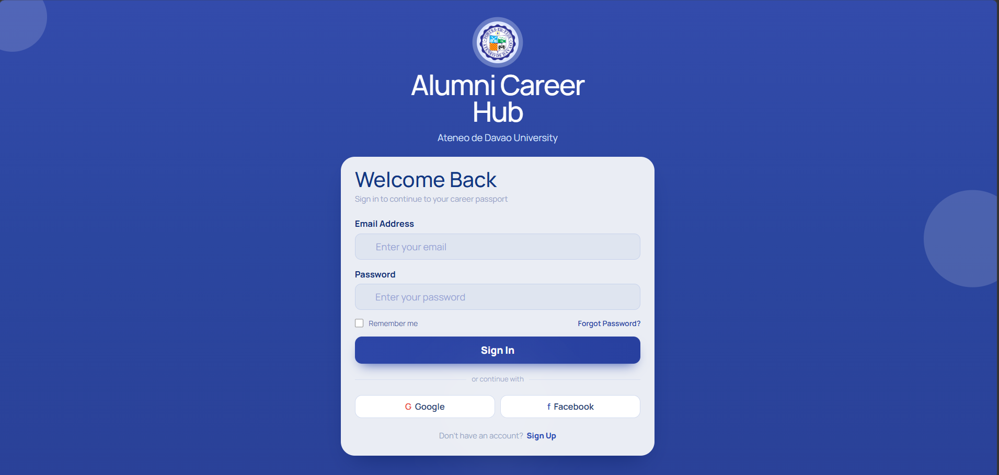

### 2nd Image: src/assets/SignupPage.png
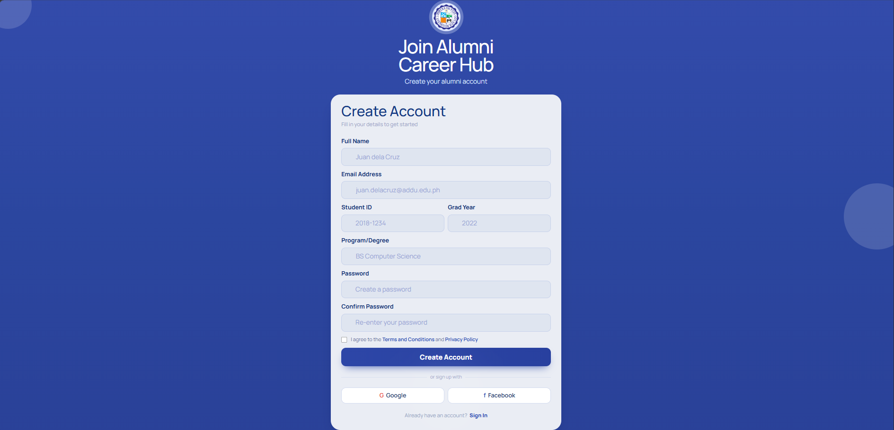

### 3rd Image: src/assets/HomePage.png
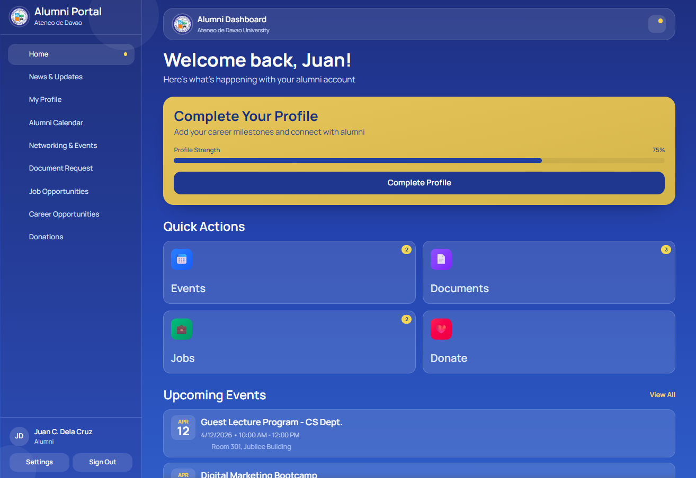

### 4th Image: News & Updates page
src/assets/News&Updates.png
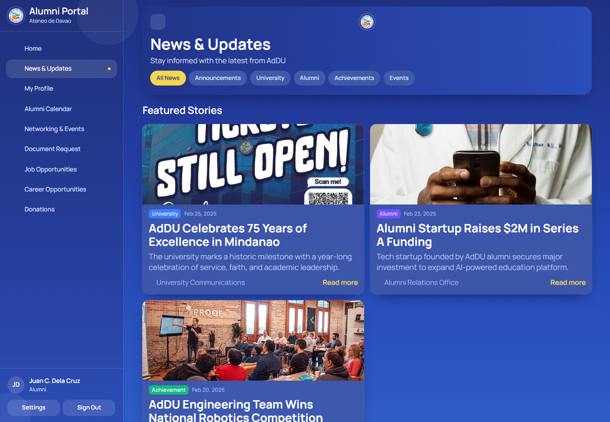

### 5th Image: My profile page
src/assets/MyProfile.png
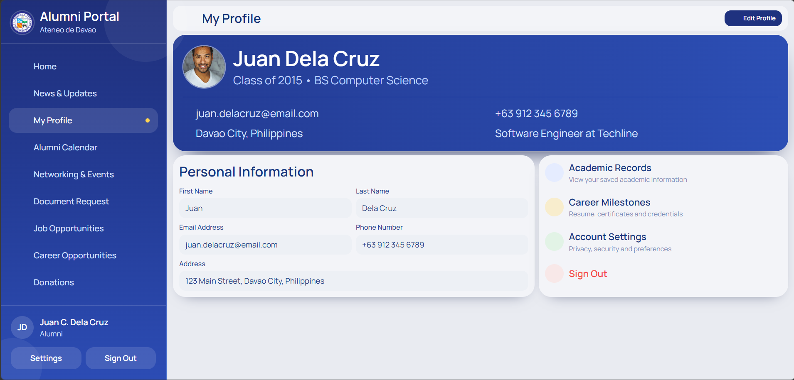

### 6th Image: Alumni calendar page
src/assets/AlumniCalendar.png
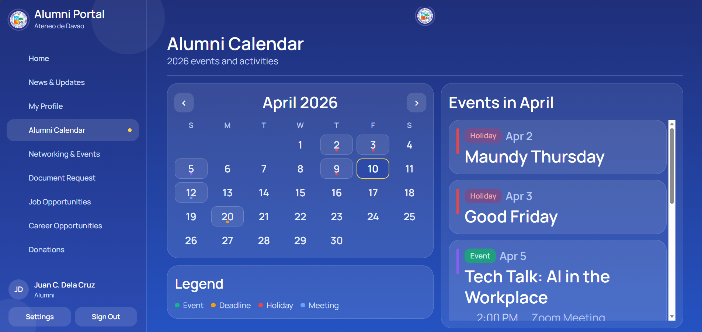

### 7th Image: Networking & Events page
src/assets/Networking&Events.png
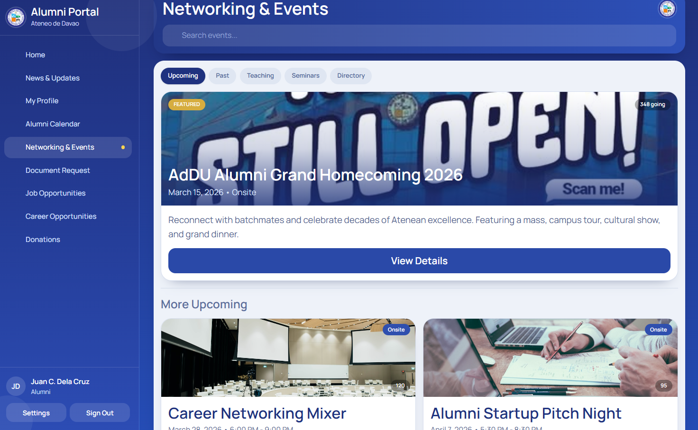
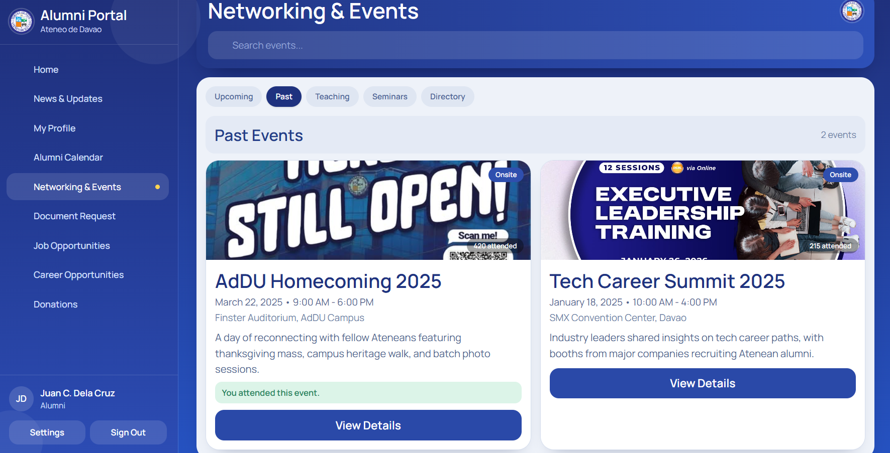
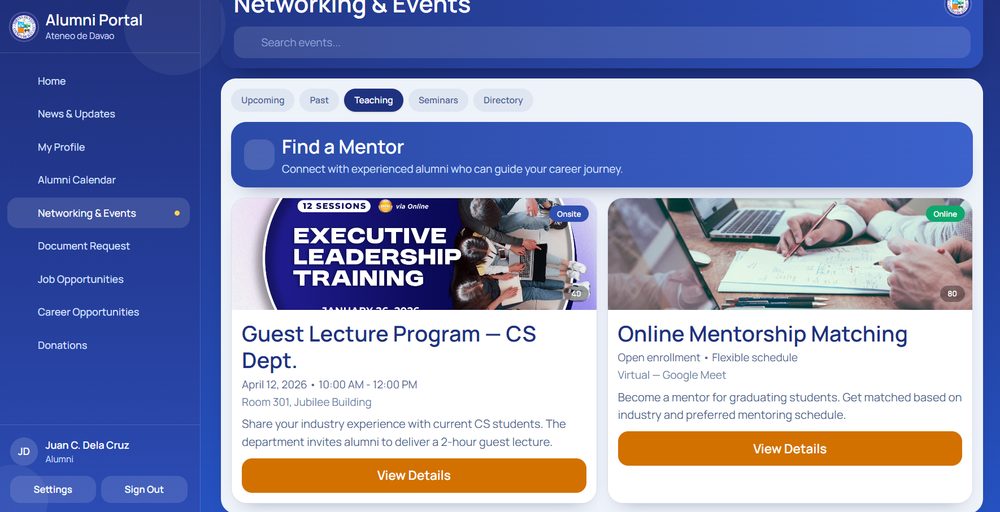
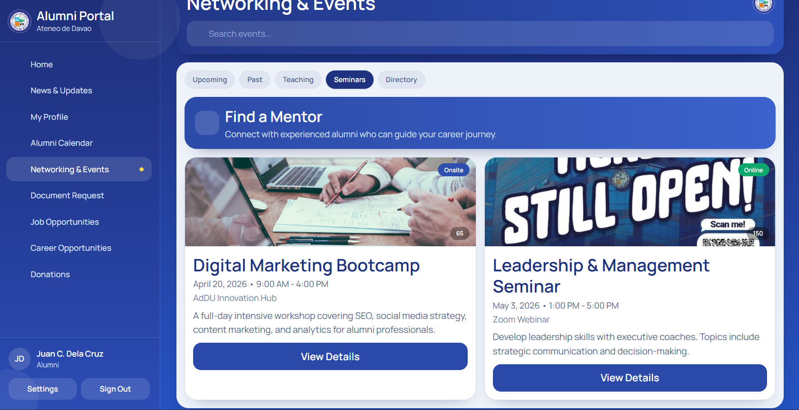
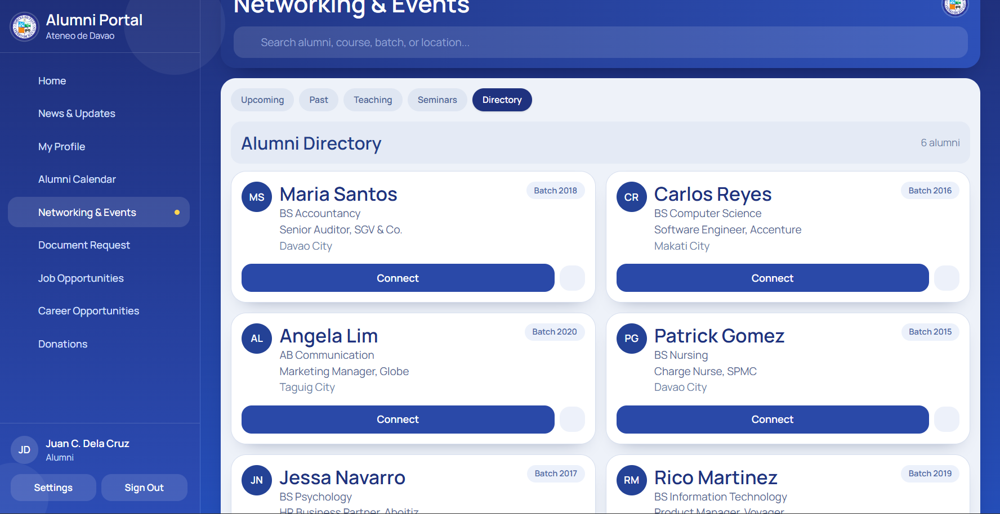
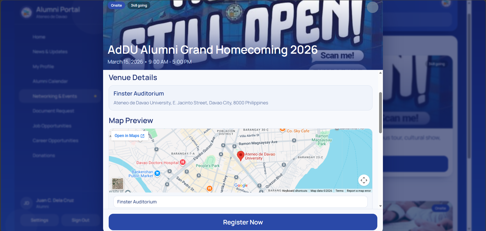
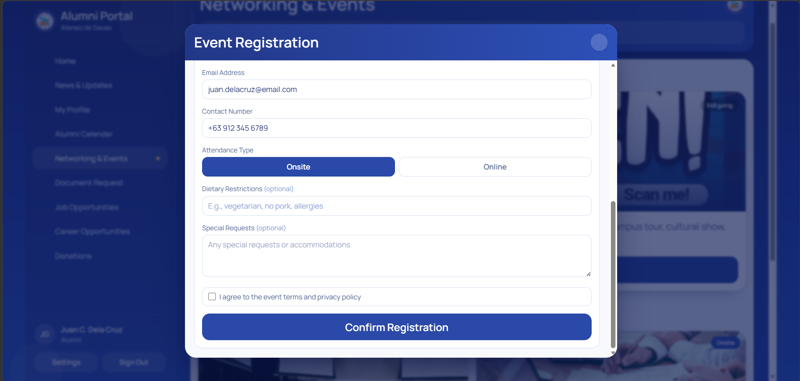
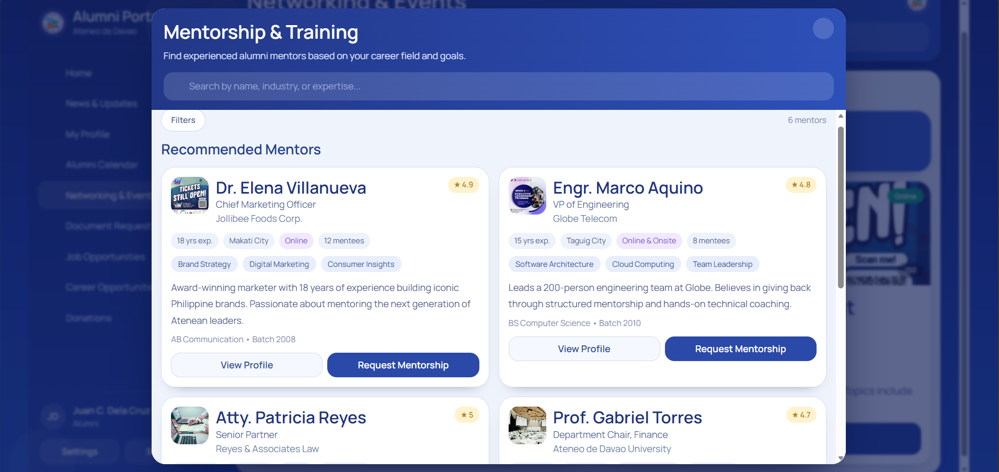


